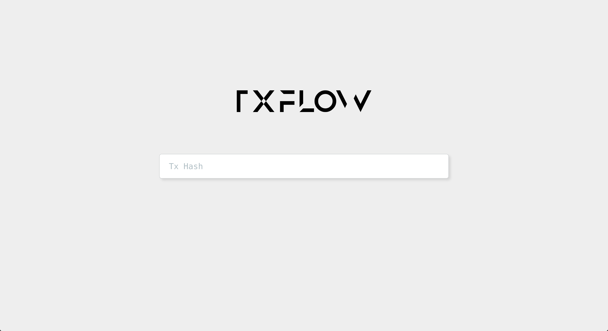

# Tx Flow

> See the full execution path for a given transaction, both cross contract and within a single contract.



Tx Flow allows Ethereum developers to easily see the whole execution flow for a given transaction.

As Smart Contracts are getting more complex, we are slowly losing visibility of what is actually happening within a single transaction. This is especially true when a Smart Contract interacts with other Smart Contracts.

## How to run
First install all dependencies, and run the front-end:
```bash
go get ./...
cd ui
yarn install
yarn start
```

The next step is to run a geth node in another terminal session:
```bash
make geth
```

After running the geth node, open another terminal window and either deploy your own contracts to the node or use our example:
```bash
make setup
```

Finally you can run the Tx Flow backend:
```bash
go run .
```

If you navigate to [http://localhost:3000](http://localhost:3000) you should see the application running.

Enter the hash of the transaction you want to trace and see the call stack instantly.

## Demo
<a href="https://www.youtube.com/watch?v=jNuI34Sk758"></a>